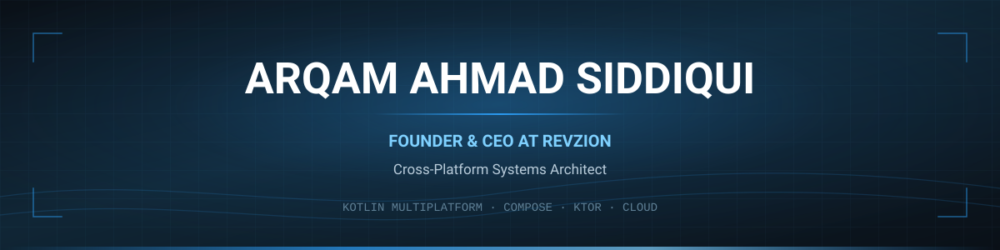

<div align="center">




<br/>

[](https://www.arqam365.com/)
[](https://www.revzion.in/)
[](https://linkedin.com/in/arqam365)
[](https://x.com/arqam365)
[](mailto:connect@revzion.in)


</div>

---

> **Architecture is not about trends. It's about durability under pressure.**

I'm **Arqam** — founder and CEO of [**Revzion**](https://www.revzion.in/), a software engineering company building SaaS platforms, AI-driven systems, and cross-platform mobile products for startups and enterprises.

I run the company *and* stay in the codebase. Most of what I build sits at the intersection of **Kotlin Multiplatform**, **real-time architecture**, **BLE connectivity**, and **production-grade backend infrastructure** — systems that have to survive real traffic, not staging demos.

---

## What I Actually Do

<table>
<tr>
<td width="33%" valign="top">

**FOUNDER &amp; CEO**

Set product direction, own the P&L, hire and grow the engineering team, and stay accountable for what ships. Every architectural decision is also a business decision.

</td>
<td width="33%" valign="top">

**SYSTEMS ENGINEER**

Kotlin Multiplatform, Compose Multiplatform, Ktor, and BLE. One codebase, two platforms, zero behavioral drift — with native-grade performance.

</td>
<td width="33%" valign="top">

**PRODUCT ARCHITECT**

Schema-first data modeling, secure API contracts, modular service layers. Designed so that refactors never turn into rewrites.

</td>
</tr>
</table>

---

## Currently Building

| Project | What it is | Stack |
|---|---|---|
| **Revzion Platform** | Greenfield SaaS product — auth flows, role-based access, scalable APIs, deploy pipelines. Built for evolution, not accumulated debt. | Kotlin · Ktor · MongoDB · Cloud |
| **Evolwe Ring** | Wearable ring companion app. Real-time BLE connectivity, sync, and state consistency across Android and iOS. | KMP · Compose MP · BLE |
| **Merakaam** | Cross-platform product platform with shared domain logic and native UI layers. | KMP · Compose MP · Ktor |
| **Revzion Engineering** | SaaS, AI systems, and cross-platform delivery for clients worldwide. | Full-stack |

## Previously Shipped

| Project | What it is |
|---|---|
| **Suraksha Kawach** | Personal safety platform — web and Android — built at [Panthar InfoHub](https://www.pantharinfohub.com/). |
| **ELearn** | Cross-platform education platform: dynamic content management, Razorpay payments, adaptive UI. |
| **MediCognition · TrackHub** | Early Revzion Android and Kotlin products — [org repositories](https://github.com/Revzion). |

---

## Engineering Principles

```txt
1. Systems > hype.            Trends expire. Durability compounds.
2. Ship, then scale.          A shipped system teaches more than a perfect design doc.
3. No architectural debt.     Pay it now, or pay it with interest during the rewrite.
4. One codebase, no drift.    Shared logic, native UI. Never two parallel stacks.
5. Design for the refactor.   Requirements will change. Build so that stays cheap.
6. Performance is a decision. Embedded in architecture, not retrofitted later.
7. Own the outcome.           Founder or engineer — the system working is the job.
```

---

## Tech Stack

**Core — what I reach for first**


**Backend and data**


**Web**


**Cloud and infrastructure**


**Observability and tooling**


<details>
<summary><b>Also worked with</b></summary>

<br/>


</details>

---

## GitHub

<div align="center">

<picture>
  <source media="(prefers-color-scheme: dark)" srcset="https://github-profile-summary-cards.vercel.app/api/cards/profile-details?username=arqam365&theme=github_dark" />
  
</picture>

<br/><br/>

<picture>
  <source media="(prefers-color-scheme: dark)" srcset="https://streak-stats.demolab.com/?user=arqam365&theme=github-dark-blue&hide_border=true&date_format=M%20j%5B%2C%20Y%5D" />
  
</picture>

<br/><br/>


<br/><br/>

<picture>
  <source media="(prefers-color-scheme: dark)" srcset="https://github-profile-summary-cards.vercel.app/api/cards/most-commit-language?username=arqam365&theme=github_dark" />
  
</picture>
<picture>
  <source media="(prefers-color-scheme: dark)" srcset="https://github-profile-summary-cards.vercel.app/api/cards/productive-time?username=arqam365&theme=github_dark&utcOffset=5.5" />
  
</picture>

<br/><br/>


</div>

<details>
<summary><b>Where the hours actually go — WakaTime</b></summary>

<br/>

[](https://wakatime.com/@d4c514ab-62be-4780-9d89-ff1737a25a78)

| Project | Tracked time |
|---|---|
| Evolwe Ring | [](https://wakatime.com/@d4c514ab-62be-4780-9d89-ff1737a25a78) |
| Merakaam | [](https://wakatime.com/@d4c514ab-62be-4780-9d89-ff1737a25a78) |
| Suraksha Kawach | [](https://wakatime.com/@d4c514ab-62be-4780-9d89-ff1737a25a78) |


</details>

---

## Work With Me

I take on a small number of engagements a year — usually where the system has to outlive its first version.

- **Building a cross-platform product?** KMP and Compose Multiplatform: shared logic, native feel, no parallel stacks.
- **Backend buckling under load?** API contracts, authentication, data modeling, and a real scaling path.
- **Founder to founder?** Happy to talk product architecture, engineering hiring, or technical strategy.

<div align="center">

[](https://www.arqam365.com/)
[](https://www.revzion.in/)
[](mailto:connect@revzion.in)

</div>

**Contact**

- Business — [connect@revzion.in](mailto:connect@revzion.in)
- Personal — [arqamahmad365.au@gmail.com](mailto:arqamahmad365.au@gmail.com)
- LinkedIn — [/in/arqam365](https://linkedin.com/in/arqam365)
- Sites — [arqam365.com](https://www.arqam365.com/) · [revzion.in](https://www.revzion.in/)

<details>
<summary><b>Everywhere else</b></summary>

<br/>

[](https://x.com/arqam365)
[](https://stackoverflow.com/users/15816773/arqam-ahmad-siddiqui)
[](https://medium.com/@arqam365)
[](https://www.behance.net/arqam365)
[](https://mastodon.social/@arqam365)
[](https://instagram.com/arqam365)
[](https://youtube.com/@arqam365)
[](https://twitch.tv/arqam365)
[](https://reddit.com/user/arqam365)
[](https://quora.com/profile/Arqam-Ahmad-9)
[](https://facebook.com/arqam365)

</details>

---

<details>
<summary><b>About this page</b></summary>

<br/>

The portrait and the header are generated, not embedded from anyone else's
server. `assets/portrait.svg` is a photo pushed through a character ramp by
[`scripts/make_portrait.py`](scripts/make_portrait.py); `assets/header.svg` is
hand-written SVG. Both are committed here, so neither can rate-limit or go dark
the way a badge service can — and several already had: the trophy, activity
graph, contributor stats and visitor counter this README used to carry were all
returning `402` or `404`.

The portrait animates with SMIL, because GitHub strips scripts from READMEs.
Each row is revealed by a `clipPath` wipe, staggered top to bottom and frozen at
the end, so it prints once and stops. The clip rect carries its finished width
as a plain attribute and SMIL animates it up from zero — a renderer that ignores
SMIL shows the completed portrait rather than an empty box.

Every row is drawn with `textLength` and `lengthAdjust="spacingAndGlyphs"`,
which pins each one to the same width in any renderer. The grid assumes a
monospace advance of 0.600 em, and a viewer whose default monospace is narrower
(Consolas is about 0.55) would otherwise see the portrait squeezed. Pinning the
width costs nothing and avoids inlining a subset font to guarantee it.

The stat cards below are still third-party. They are the part of this page that
can break, so they are the part worth re-checking.

</details>

<div align="center">

<sub>Systems &gt; hype. If something here is useful to you, a star costs nothing and means a lot.</sub>

</div>
