<div align="center">




[arqam365.com](https://www.arqam365.com/) &nbsp;·&nbsp;
[revzion.in](https://www.revzion.in/) &nbsp;·&nbsp;
[linkedin](https://linkedin.com/in/arqam365) &nbsp;·&nbsp;
[x](https://x.com/arqam365) &nbsp;·&nbsp;
[email](mailto:connect@revzion.in)

</div>


> Founder and CEO of [Revzion](https://www.revzion.in/), in Jhansi, India.<br>
> Systems over hype. Architecture is judged by what survives contact with load.

I run the company and stay in the codebase. Most of what I build sits where<br>
Kotlin Multiplatform meets real-time architecture, BLE, and backends that have<br>
to hold up under real traffic rather than a staging demo.


**founder &amp; ceo** &nbsp;·&nbsp; <samp>direction, P&amp;L, hiring</samp><br>
Set product direction, own the P&amp;L, hire and grow the engineering team, and<br>
stay accountable for what ships. Every architectural decision is also a<br>
business decision.

**systems engineer** &nbsp;·&nbsp; <samp>kmp, compose, ktor, ble</samp><br>
One codebase, two platforms, zero behavioural drift — with native-grade<br>
performance, not a wrapper.

**product architect** &nbsp;·&nbsp; <samp>schemas, contracts, services</samp><br>
Schema-first data modelling, secure API contracts, modular service layers.<br>
Designed so that refactors never turn into rewrites.


<samp>kotlin &nbsp; kmp &nbsp; compose &nbsp; ktor &nbsp; android &nbsp; ble &nbsp; mongodb &nbsp; postgres &nbsp; firebase &nbsp; typescript &nbsp; react &nbsp; next.js &nbsp; node &nbsp; python &nbsp; docker &nbsp; kubernetes &nbsp; gcp &nbsp; aws &nbsp; grafana &nbsp; prometheus</samp>


**[Revzion](https://www.revzion.in/)** &nbsp;·&nbsp; <samp>kotlin, ktor, mongodb</samp><br>
SaaS platforms, AI systems and cross-platform delivery for startups and<br>
enterprises. Auth flows, role-based access, scalable APIs, deploy pipelines,<br>
built for evolution rather than accumulated debt.

**Evolwe Ring** &nbsp;·&nbsp; <samp>kmp, compose, ble</samp><br>
Wearable ring companion app. Real-time BLE connectivity, sync, and state<br>
consistency held identical across Android and iOS from one codebase.

**Merakaam** &nbsp;·&nbsp; <samp>kmp, compose, ktor</samp><br>
Cross-platform product platform: shared domain logic, native UI layers,<br>
no second stack to keep in step.


**Suraksha Kawach** &nbsp;·&nbsp; <samp>android, web</samp><br>
Personal safety platform, web and Android, built at<br>
[Panthar InfoHub](https://www.pantharinfohub.com/).

**ELearn** &nbsp;·&nbsp; <samp>cross-platform</samp><br>
Education platform with dynamic content management, Razorpay payments,<br>
and an adaptive UI.

**MediCognition &nbsp;·&nbsp; TrackHub** &nbsp;·&nbsp; <samp>kotlin, android</samp><br>
Early Revzion products — [org repositories](https://github.com/Revzion).


```txt
1. Systems > hype.            Trends expire. Durability compounds.
2. Ship, then scale.          A shipped system teaches more than a perfect design doc.
3. No architectural debt.     Pay it now, or pay it with interest during the rewrite.
4. One codebase, no drift.    Shared logic, native UI. Never two parallel stacks.
5. Design for the refactor.   Requirements will change. Build so that stays cheap.
6. Performance is a decision. Embedded in architecture, not retrofitted later.
7. Own the outcome.           Founder or engineer — the system working is the job.
```


<div align="center">




</div>


I take on a small number of engagements a year — usually where the system has<br>
to outlive its first version.

**Building a cross-platform product?** &nbsp; KMP and Compose Multiplatform:<br>
shared logic, native feel, no parallel stacks.

**Backend buckling under load?** &nbsp; API contracts, authentication, data<br>
modelling, and a real scaling path.

**Founder to founder?** &nbsp; Product architecture, engineering hiring, or<br>
technical strategy.

<samp>business</samp> &nbsp; [connect@revzion.in](mailto:connect@revzion.in)<br>
<samp>personal</samp> &nbsp; [arqamahmad365.au@gmail.com](mailto:arqamahmad365.au@gmail.com)<br>
<samp>linkedin</samp> &nbsp; [/in/arqam365](https://linkedin.com/in/arqam365) &nbsp;·&nbsp;
<samp>x</samp> &nbsp; [@arqam365](https://x.com/arqam365) &nbsp;·&nbsp;
<samp>stack overflow</samp> &nbsp; [arqam-ahmad-siddiqui](https://stackoverflow.com/users/15816773/arqam-ahmad-siddiqui)


Every graphic here is generated, not embedded from anyone else's server.<br>
`portrait.svg` is a photo pushed through a character ramp by<br>
[`scripts/make_portrait.py`](scripts/make_portrait.py); the stat graphics and<br>
these section headings are drawn by [a scheduled action](.github/workflows/stats.yml)<br>
straight from the GitHub GraphQL API, once a day, committing only what changed.

They animate with SMIL inside the SVG, because GitHub strips scripts from<br>
READMEs — and since nothing loads from a third party, nothing here can<br>
rate-limit or go dark. This page used to carry a trophy, an activity graph, a<br>
contributor-stats card and a visitor counter; all four were returning `402` or<br>
`404` to anyone who visited. The headings are SVGs for the same reason: GitHub<br>
also strips CSS, so an image is the only way to put this page's own typeface<br>
on them.

The typeface is [JetBrains Mono](scripts/fonts), subset to just the characters<br>
each graphic draws and inlined as base64. That isn't only for looks: the<br>
portrait's grid assumes an advance width of exactly 0.600 em, and a viewer<br>
whose default monospace is narrower would otherwise see it squeezed. An<br>
external font URL cannot work — these SVGs load through ``, and browsers<br>
refuse subresource fetches for an image document.

Language totals cover public repositories only. `year.svg` uses the portrait's<br>
character ramp: `:` `+` `#` `@`, quiet to loud, scaled to a busy-but-typical<br>
day so an ordinary one doesn't round away to blank.
